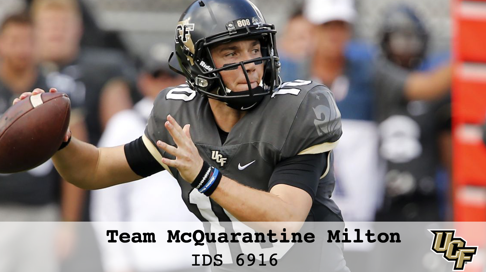

# Research Practicum 2020: Research Plan

> * Group Name: Team McQuarantine Milton
> * Group participants names: Chathura Don Dimungu Arachchige, Bradley Brown, Devin Inthavongsa, and Mathew Rubio
> * Project Title: UCF 2020 Football Season Home Game Spectator COVD Transmission 

## 1. Topic / Introduction

While health and science professionals continue to understand the nuances of COVID epidemiology, certain mitigation strategies appear to be successful in significantly reducing transmission.
As research continues, governing bodies in the form of national, state, local, education, military, and business are enacting different mitigation efforts based on balancing risk and economic need.
UCF athletics is one such organization. As the 2020 college football season starts,
college athletic programs around the nation are employing different COVID mitigation strategies for live attendance, from canceling the season to limiting spectators.  Although not allowing any spectators is the most risk-averse mitigation strategy many college athletic programs rely on home-game football ticket sales to meet budgetary benchmarks.  For example, the 20-21 UCF athletics budget is $74 million, with a significant portion coming from spectator ticket sales [(Murchel, 2020)](https://www.orlandosentinel.com/sports/ucf-knights/os-sp-ucf-athletics-budget-fundraising-20200723-uxpaa6gjlffmpdfpoc6jikag4m-story.html).

To retain some spectator revenue, UCF plans to fill 25% (no more than 11 thousand) of the Bounce House for the opening football season game.  People who decide to attend the game are required to wear a facemask; social distancing is encouraged but not enforced.  The stadium is divided into seven zones, and movement on the concourse from zone to zone is not permitted.  The current mitigation strategy will prevent overcrowding, limit intermingling, and enable physical distancing throughout the stadium.  [(UCF Athletics; Lee, 2020)](https://www.ucf.edu/news/what-fans-need-to-know-for-ucfs-2020-football-season/)

## 2. Purpose Statement

The **purpose** of the research is to determine is UCF football game attendance COVID countermeasures are appropriate in minimizing virus spread potential while maximizing attendance revenue. Using an agent-based model,  the study will determine predicted COVID transmission under current UCF athletics countermeasures and investigate  higher attendance numbers under current mitigation strategies to determine if higher attendance is possible with nominal risk.

## 3. Related Work/Review

Discuss briefly about published matter that technically relates to your proposed work in 4-5 paragraphs.

## 4. Research Method

### 4.1 Reseach Questions

Are current COVID football attendance limitation and social distancing strategies appropriate for maximizing attendance and minimizing transmission risk, while controlling for the masked COVID transmission rate?

### 4.2 Hypothesis

**Hypothesis 1:**
The number of expected infections proportional to the squared value of the attendance.

**Hypothesis 2:**
The group size does affect the number of infections (or number of contacts).

**Hypothesis 3:**
The number of expected infections is proportional to the group size.

**Hypothesis 4:**
The number of infections is not proportional to attendance capacity

### 4.3 Variables

**Independent:**
Stadium capacity and social distancing (group size), group strategy

**Dependent:**
transmission rate, number of contacts

**Control:**
Masked interpersonal transmission rate

### 4.4 Materials / Apparatus

* Anylogic agent model
* Anylogic SIR model

### 4.5 Participants

* 1,600 agent spectators
  * 6' contact zone
  * Grouping behaviors
  * Food/Bathroom behaviors

## 5. Model Demo

## PPT

**Midterm PowerPoint**
 

## References
(Add the bibliographic references you intend to use in format you want)

https://www.orlandosentinel.com/sports/ucf-knights/os-sp-ucf-athletics-budget-fundraising-20200723-uxpaa6gjlffmpdfpoc6jikag4m-story.html

https://www.ucf.edu/news/what-fans-need-to-know-for-ucfs-2020-football-season/

https://sports.usatoday.com/2020/07/05/methodology-for-2019-ncaa-athletic-department-revenue-database/

