# Research Practicum 2020: Assessing UCF Football Stadium COVID Mitigation Strategies

> * Group Name: Team McQuarantine Milton
> * Group participants names: Chathura Don Dimungu Arachchige, Bradley Brown, Devin Inthavongsa, and Mathew Rubio
> * Project Title: Assessing UCF Football Stadium COVID Mitigation Strategies

## 1. Introduction

While health and science professionals continue to understand the nuances of COVID epidemiology, certain mitigation strategies appear to be successful in significantly reducing transmission.
As research continues, governing bodies in the form of national, state, local, education, military, and business are enacting different mitigation efforts based on balancing risk and economic need.
UCF athletics is one such organization. As the 2020 college football season starts,
college athletic programs around the nation are employing different COVID mitigation strategies for live attendance, from canceling the season to limiting spectators.  Although not allowing any spectators is the most risk-averse mitigation strategy many college athletic programs rely on home-game football ticket sales to meet budgetary benchmarks.  For example, the 20-21 UCF athletics budget is $74 million, with a significant portion coming from spectator ticket sales [(Murchel, 2020)](https://www.orlandosentinel.com/sports/ucf-knights/os-sp-ucf-athletics-budget-fundraising-20200723-uxpaa6gjlffmpdfpoc6jikag4m-story.html).

To retain some spectator revenue, UCF plans to fill 25% (no more than 11 thousand) of the Bounce House for the opening football season game.  People who decide to attend the game are required to wear a facemask; social distancing is encouraged but not enforced.  The stadium is divided into seven zones, and movement on the concourse from zone to zone is not permitted.  The current mitigation strategy will prevent overcrowding, limit intermingling, and enable physical distancing throughout the stadium.  [(UCF Athletics; Lee, 2020)](https://www.ucf.edu/news/what-fans-need-to-know-for-ucfs-2020-football-season/)

## 2. Purpose Statement

The **purpose** of the research is to determine is UCF football game attendance COVID countermeasures are appropriate in minimizing virus spread potential while maximizing attendance revenue. Using an agent-based model,  the study will determine predicted COVID transmission under current UCF athletics countermeasures and investigate  higher attendance numbers under current mitigation strategies to determine if higher attendance is possible with nominal risk.

## 3. Related Work

Severe acute respiratory syndrome coronavirus 2 (SARS-CoV-2) causes COVID-19, and its mechanism of spreading is primarily driven through close person-to-person interaction. Ongoing studies and analyses of previous epidemiological data are currently underway in predicting the infection mechanism and rate of SARS-CoV-2. It is not definitely known if SARS-CoV-2 might spread through aerosols from respiratory droplets so far; sampling the air has found viral replicative material (viral RNA) in some studies, but not in others. However, finding viral RNA is not necessarily indicative of the virus' replicative and infective potential. Furthermore, the distance from which an infected individual infects another individual, as well as the optimal person-to-person physical distance, is uncertain. Because of such, quantitative assessment of physical distancing is essential in determining safe interaction in healthcare settings, non-healthcare settings, and providing important information for health policy-makers in preventing the spread of the virus.

Chu et al. (2020) published a large meta-analysis paper identifying 172 observational studies across 16 countries, with no randomized controlled trials and 44 relevant comparative studies in both healthcare and non-healthcare settings. The findings of this paper is one of the first to rapidly gather all direct information on COVID-19, and provide the best available evidence to inform optimal usages of common and simple interventions to aid in the reduction of the rate of infection. Physical distancing of 1 meter or more was associated with a drastically lowered risk of infection, as was the usage of face masks including N95 respirators and surgical masks. The authors found evidence of moderate certainty that currently placed policies of at least 1 meter physical distancing are probably associated with a large reduction in infection rates, and further suggests that distances of 2 meter might be more effective (implemented in some countries).

Furthermore, Chu et al. (2020) expressed that usage of face masks were protective of both healthcare workers and people in communal settings exposed to infection, stating that their frequentist and Bayesian analyses support the protective role of facemask utilization regardless of the setting. Some of the strengths of this paper include the researchers' adherence to systematic review methods that involved artificial intelligence-supported dual screening of titles, abstract, full-text evaluations, assessment of risk of biases, and no language limitations. The researchers, however, did not go into depth the full incorporation and explanation of the artificial intelligence other than through mention in their acknowledgements section. The primary limitation of this meta-analyses paper is that all the studies involved were non-randomized, not adjusted, and may suffer from recall and measurement bias.

Jarvis et al. (2020) published a paper centered around the estimation of 'R naught' (R0) in the United Kingdom (UK). R0 is the potential transmission of a disease; R0 < 1 - each existing infection causes less than one new infection; R0 = 1 - each existing infection causes one new infection; R0 > 1 - each existing infection causes more than one new infection and may cause an outbreak or epidemic. The universally accepted R0 for SARS-CoV-2 is still uncertain, but this study seeks to establish some metric to base viral-spread interventions, especially through physical distancing measures that may lead to substantial decreases in contact levels. This study asked a representative sample of UK adults (1356 UK participants) about their contact patterns on the day prior and recorded 3849 contacts. The estimation of R0 prior to lockdown (in the UK) was 2.6, and the authors found that, under current social distancing measures, the current R0 estimation was lowered to 0.62 based on all types of contact.

## 4. Research Method
### Overview
The methodology seeks to establish the baseline COVID transmission risk with current attendee mitigation strategies (25% capacity, zone segregation). Followed by testing to identify at what attendance threshold and combination of mitigation strategies allow for increased home game attendance without increasing COVID transmission risk.

The participants for our experiment are simulated football game attendees using anylogic. One mitigation strategy for UCF home games is segregating the stadium into seven unilateral sections that cannot interact with each other, which means that each section has its own entry/exit, bathrooms, and concessions. Our population consists of the capacity of one such section, up to a total of 1,342 simulated spectators. The simulation agents are unique to our study in two ways. First, the agents will have a 6 ft. boundary around each that will help us measure the number of contacts each agent has with other agents. Second, the agents will be capable of being a part of different sized groups, a transmission variable we plan to test.  

Our primary tool is AnyLogic. We constructed an agent-based simulation that allows us to adjust the population, movement patterns, and group sizes. The primary output of our agent base simulation is to identify the number of contacts and contact times between unique agents.  

The dependent variables for our experiment are the number of agent contacts and attendee infection rate. Independent variables are the attendance capacity and attendee group sizes. Parameter variations are summarized in the table below.

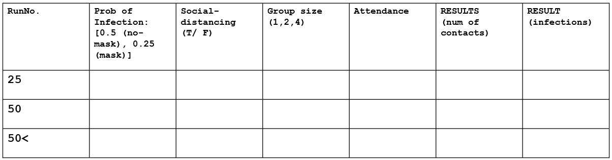

The experiment process follows the table above. Data will be collected using anylogic and include agent contact statistics and infection statistics based on research-informed
Ro values and the initial value of the SIR infection. Data Analysis will be conducted in RStudio.

### 4.1 Reseach Questions

Are current football attendance limitation and social distancing strategies appropriate for maximizing attendance and minimizing transmission risk, while controlling for the masked COVID transmission rate?

### 4.2 Hypothesis

**Hypothesis 1:**
The group size does affect the number of infections (or number of contacts).

**Hypothesis 2:**
The number of expected infections is proportional to the group size.

**Hypothesis 3:**
The number of infections is not proportional to attendance capacity

### 4.3 Variables

**Independent:**
* Attendance Capacity: Total number of agents in the population. (values = {132:1342})

* Number of groups: Number of groups of agents. (values = {50, 100, 150, 200, 250, 300})
* Seat Gaps: Number of seats left off for social distancing. (values = {0, 4})
* Minimum Group Size: Minimum number of agents that are in a group. (values = {1})
* Maximum Group Size: Maximum number of agents that is allowed for a group. (values = {4, 5, 6, 7, 8})
* Location and Group of Infected Agent: The number of infected agents is a control for this experiment; however, the group in which they are included and starting location is an independent variable.
* Transmission Range: Distance considered for counting as a contact/exposure (values = {33}) . 30 pixels was modeled as 1 yard. Therefore, 33 pixels is approximately 1 meter.

**Dependent:**

* Susceptible Agents: Number of susceptible people in the population at the final state of the simulation.

* Number of Exposed Sitting: Number of agents who got exposed to an infected person while they were sitting (due to sitting near an infected person)
* Number of Exposed Walking: Number of people who got exposed to an infected person while they were walking.
* Extra-group Exposure Sitting: Number of agents who got exposed to an infected agent from a different group than their own group while sitting.
* Extra-group Exposure Walking: Number of agents who got exposed to an infected agent from a different group than their own group while walking.
* Number of Contacts Sitting: Number of agents who got contacted with at least one agent from a different group than their own group while sitting.
* Number of Contacts Walking: Number of agents who got contacted with at least one agent from a different group than their own group while walking.
* Mean Exposed Time Sitting: Mean of number of seconds an agent is in contact range of an infected agent while sitting.
* Mean Exposed Time Walking: Mean of number of seconds an agent is in contact range of an infected agent while walking.

* Mean Contact Time Sitting : Mean of number of seconds an agent spends in contact range of another agent while sitting.
* Mean Contact Time Walking: Mean of number of seconds an agent spends in contact range of another agent while walking.
* Seat Search: Time (in minutes) spent for all agents to enter the stadium an sit down.

**Control:**

* Simulation time: The simulation runs in real time for one hour.

* Io: Number of initially infected agents. (values = {10}).
* Ro: Likelihood of a susceptible agent contracting COVID from an infected agent.    

### 4.4 Materials / Apparatus

* Anylogic: [Anylogic](https://www.anylogic.com/) is a multi-method modeling and simulation tool that supports agent based, discrete, continuous and dynamic event modeling.
it offers visual logic, 3D representation, and data analysis. AnyLogic is used to create our agent based simulation logic, data collection, and 3D visualization.   

* RStudio: [RStudio](https://rstudio.com/) is an open source R IDE for statistical data analysis and visualization. RStudio is used to analyze the AnyLogic response variable output.   
* Real world observation: The stadium was observed in two conditions. First, while empty to acquire precise measurements for accurate spacial modeling.
Second, during live game-day conditions to observe and confirm COVID mitigation strategies for behavioral modeling.

### 4.5 Simulation Development
The primary goal of the UCF Football Game Attendance was to accurately model the UCF football stadium student section. A scaled map of the
stadium was selected to provide the base of the model.

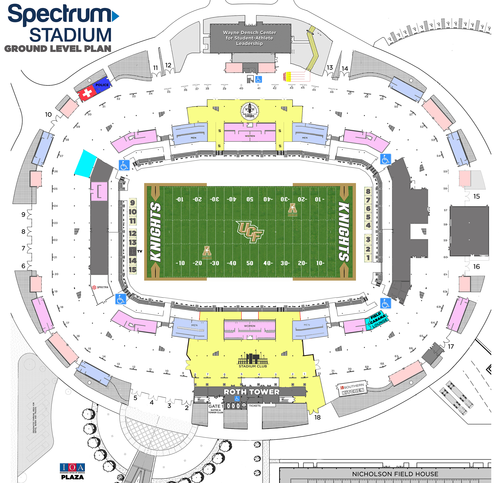

[image credit: [ucfknights.com](https://ucfknights.com/sports/2018/10/30/211778281.aspx) ]

To create high spacial fidelity, the research team conducted a survey of the stadium. The survey was used to confirm the map scale and record measurements
to construct the stadium model.

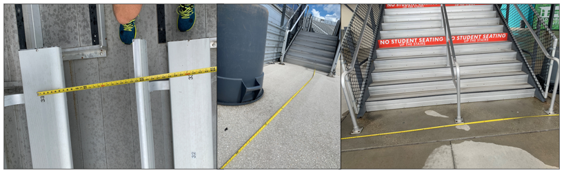

To observe and model UCF football game COVID mitigation strategies, the survey team attended a home game under COVID mitigation policies.
The team observed the stadium at 25% capacity with mandatory seat spacing.

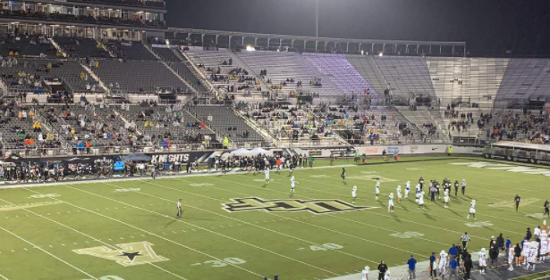

[image credit: [www.clickorlando.com](https://www.clickorlando.com/news/local/2020/10/04/ucf-knights-play-tulsa-with-new-coronavirus-rules-for-fans/) ]

Using AnyLogic software, the research team created a to-scale model of the UCF football stadium student section. 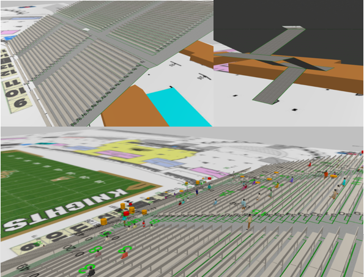

### 4.6 Participants

* 1,342 agent spectators
  * 6' contact zone
  * Grouping behaviors
  * Seat finding behaviors
  * SIR state markers

The AnyLogic agent population ranges from 132 to 1342 depending on parameter configuration. Each agent has a six foot contact
radius that tracks when agents pass inside of the radius. Agents that are infected are marked with a red disc above their heads. Exposed
agents are marked with an orange disc above their head. Additionally, the orange exposed disc increases its y value length based on the time
an agent is in contact with an infected agent. Finally, the agents display both seat searching and grouping behaviors. The seat searching behavior
models people entering the stadium and looking for their seat before sitting. The grouping behavior models people arriving and watching the game
as a group.

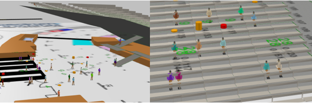

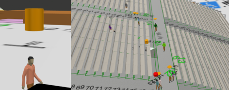

### 4.7 Simulation Experiment
The simulation experiment consisted of 60 parameter configuration experiments. Below is a table of each experiment.

## 5. Findings
Findings were analyzed using RStudio. This section will address each hypothesis with data visualization and analysis.

### 5.1 Hypothesis 1
##### The group size does affect the number of infections (or number of contacts).
The data shows that group size does affect the number of agent exposures to infected agents across attendance
capacities.

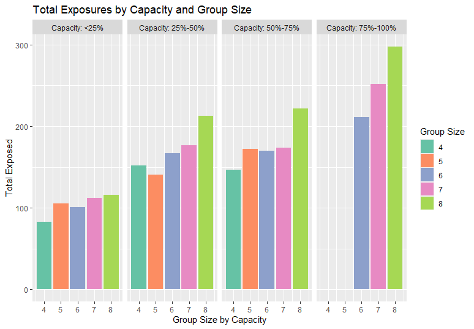

The plot above shows the positive collation in group size and total exposure count across stadium capacities. Of note, the middle group sizes
in the 50%-75% did not increase incrementally.

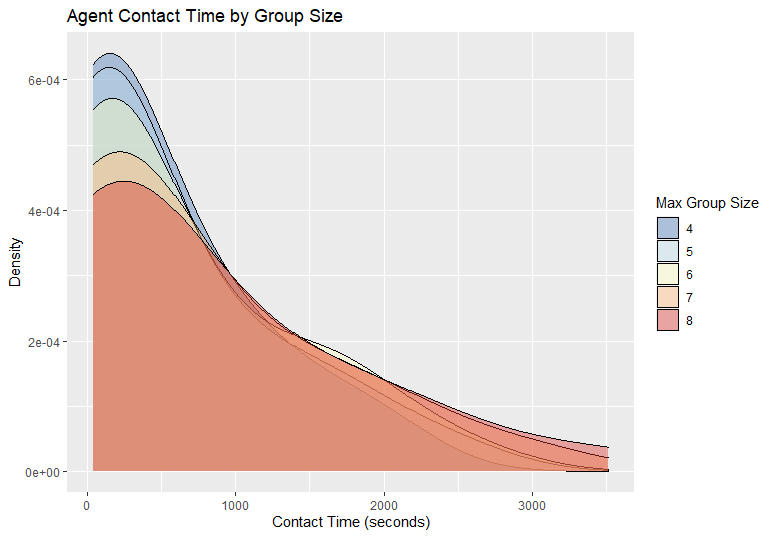

The contact time by group size plot above affirms the hypothesis as well. Smaller group sizes see lower ammounts
of total contact time between agents. Alternatively, the larger group sizes see an increased contact time.

### 5.2 Hypothesis 2
##### The number of expected infections (contacts) is proportional to the group size.
The data shows that the risk of infection is not directly proportional to group size across attendance capacities and agent states (walking or seated)

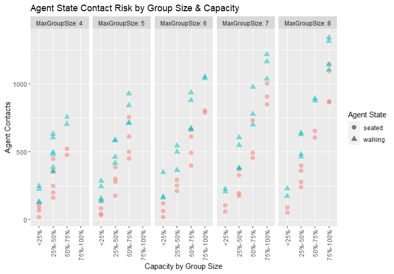

The plot above shows that group size contacts stay relatively the same for group sizes 4, 5, and 6 when attendance capacity is
is in the 50%-75% quartile or below. Group sizes 7 and 8 show an increase in contacts at capacities above 25%.

### 5.3 Hypothesis 3
##### The number of infections is not proportional to attendance capacity.
The data shows that attendance capacity and infection exposures are positively correlated

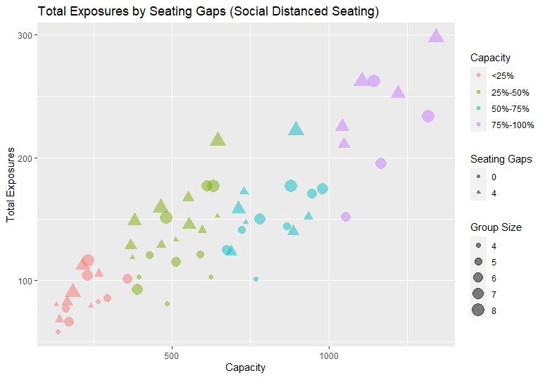

The plot above shows that total exposures are positively correlated to attendance capacity across group sizes and mandatory seat spacing.

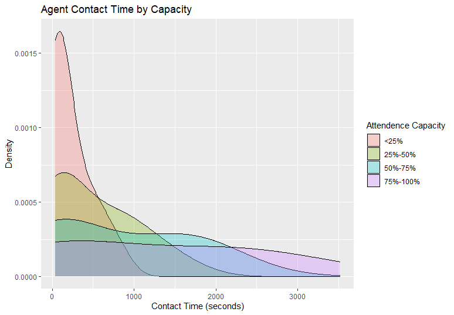

Additionally, the agent contact time by attendance capacity density plot above shows that agent contact time
is shorter at low capacity, and well distributed at the higher capacities.  

### 5.4 Additional Data of Interest
The two plots below show that agents experience a higher number of contacts while walking. However contact time
while seated was significantly higher than walking.

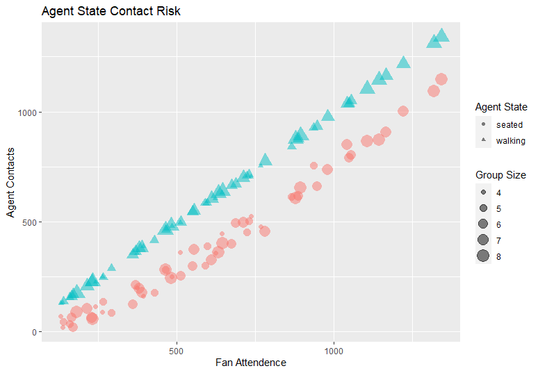

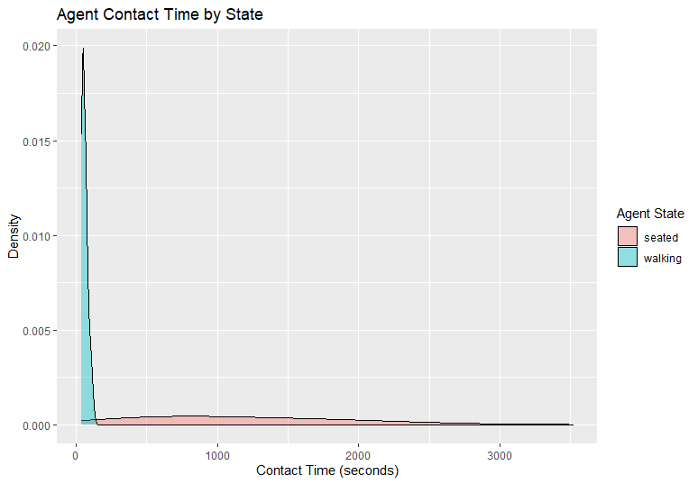

### 5.5 Putting it Together
Overall, higher attendance capacity positively correlated with elevated exposures. However, agents contacts, or risk of transmission remained flat
from 25%-75% at group sizes 6 or below. Additionally, contact time between group sizes 4 through 6 remained
similar before a significant increase in group sizes 7 or above. Walking saw a greater number and diversity of short duration contacts,
while sitting significantly extended contact time, however, with a lower number and diversity of contacts.

## 6. Recommendations and Future Research
### 6.1 Recommendations
Capacity can be increased without significant a transmission risk increase. Below are recommendations to limit both the number and duration of contacts, and therefore, reduce transmission risk.

##### 1. Limit diversity of contacts.
* Stadium Entrance "Boarding Groups" to limit the funnel effect of limited entry points at specified times
* Uni-directional  movement to prevent additional contacts of bidirectional movement (see suggested map below)

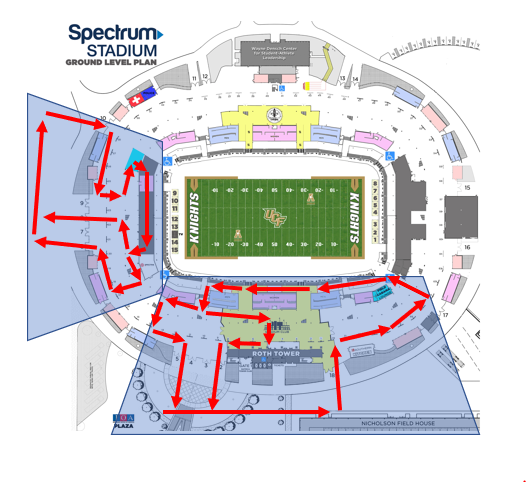

##### 2. Limit spectating contact time (sitting)
* Limit group sizes to 6 or below. The findings show that group sizes 7 or above do correlate with higher contact rates.
* Change seat spacing. Current UCF football game COVID mitigation only requires one vertical row space, however, this is still within the recommended 6 foot social distancing radius.

##### 3. Limit Io and Ro
During the observational research, it was noted that there were no entry temperature checks and mask wearing in the stand was not enforced.
Reducing both the initial infected value and the probability of Ro transmission will reduce overall exposure risk  

### 6.2 Future Research

COVID Aerosol Modeling
  - This presentation lightly touched on Aerosol research and its contributions to the emission of respiratory particles. Deriving data from current literature and upcoming experiments related to aerosol research can be used for modeling in future projects. Our simulation highlights the effects of social distancing and other similar policies, but not the aerosol SARS-CoV-2 droplets that can remain in the air and potentially influence the infection/exposure rates, especially taking into account of individuals who do not wear face masks nor practice social distancing.

Seat Spacing Optimization
 - As noticed in the model, the way UCF is managing seat spacing is not the most efficient way.  As the simulation proved, it is very easy to get exposed to the virus if an infected agent is sitting on the front or back.  Being able to simulate different seating strategies its definitely something to be consider on future research.

Unidirectional Traffic Pattern Efficacy
 - Unfortunately, UCF did not have any plan to manage pedestrian flow. After they entered the stadium they were free to roam around and go wherever they wanted, maximizing the exposure to the virus.  Future research should look into efficient ways to direct traffic while keeping the pedestrian flow moving smoothly.

Bigger Scale (Whole Stadium, adding more behaviors)
 - This simulation focused on the first quarter of the game, including people entering to the stadium and looking for their seats.  Further research should look into simulating the whole game and add more behaviors such as using the restroom and getting food.  In addition, it will be interesting to see the effect that weather has on the spread of the virus.  
 
 ### 6.3 Conclusion
 
 Overall, the 25% attendance capacity limit is an appropriate approximation to mitigate COVID transmission
 with limited data or research. As COVID research continues, it appears that contact time is the prevalent factor in 
 transmission. Even at 25% capacity, the current UCF football mitigation strategies to not leverage the full advantage 
 of a lower capacity due to seat gap layout. Based on our findings, UCF could increase capacity to between 24% and 50% by enforcing the
 seat pattern below on the left (2 row vertical gap) when compared to the current seat gap strategy on the right.
 
 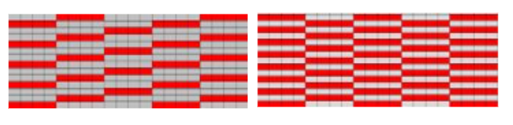.
 
 This small change alone could increase the capacity to 35% without changing any other mitigation strategies, which could earn
 the UCF Athletic program an additional ~ $1,200,000 in ticket sales revenue over the course of a football season. Applying group size strategies and unidirectional movement
 could allow for an even higher attendance capacity, up to 50%, with negligible increase in transmission risk.        
 
 
## References

- [Bouchnita, A., & Jebrane, A. (2020). A hybrid multi-scale model of COVID-19 transmission dynamics to assess the potential of non-pharmaceutical interventions. Chaos, Solitons & Fractals, 109941.](https://www.sciencedirect.com/science/article/pii/S0960077920303404?casa_token=It_NawpEwfUAAAAA:yOCsDOdT_8y1PFQ2cypB6o1IQRARaAfBFGCkl0OMqnq1_ibmzLBTY7tJ2FAwBaDBzdj1kIvNKA)

- [Chu, D. K., Akl, E. A., Duda, S., Solo, K., Yaacoub, S., Schünemann, H. J., ... & Hajizadeh, A. (2020). Physical distancing, face masks, and eye protection to prevent person-to-person transmission of SARS-CoV-2 and COVID-19: a systematic review and meta-analysis. The Lancet.](https://doi.org/10.1016/S0140-6736(20)31142-9)

- [D'Orazio, M., Bernardini, G., & Quagliarini, E. (2020). How to restart? An agent-based simulation model towards the definition of strategies for COVID-19" second phase" in public buildings. arXiv preprint arXiv:2004.12927.](https://arxiv.org/ftp/arxiv/papers/2004/2004.12927.pdf)

- [Fang, Z., Huang, Z., Li, X., Zhang, J., Lv, W., Zhuang, L., ... & Huang, N. (2020). How many infections of COVID-19 there will be in the" Diamond Princess"-Predicted by a virus transmission model based on the simulation of crowd flow. arXiv preprint arXiv:2002.10616.](https://arxiv.org/ftp/arxiv/papers/2002/2002.10616.pdf)

- [Jarvis, C. I., Van Zandvoort, K., Gimma, A., Prem, K., Klepac, P., Rubin, G. J., & Edmunds, W. J. (2020). Quantifying the impact of physical distance measures on the transmission of COVID-19 in the UK. BMC medicine, 18, 1-10.](https://link.springer.com/content/pdf/10.1186/s12916-020-01597-8.pdf)

- [Lee, J. M. (2020, November 10). What Fans Need to Know for UCF's 2020 Football Season: University of Central Florida News. Retrieved December 10, 2020](https://www.ucf.edu/news/what-fans-need-to-know-for-ucfs-2020-football-season/)

- [Murschel, M. (2020, July 24). UCF cuts athletic budgets by 10%, seeks donors to offset COVID-19 losses. Retrieved December 10, 2020](https://www.orlandosentinel.com/sports/ucf-knights/os-sp-ucf-athletics-budget-fundraising-20200723-uxpaa6gjlffmpdfpoc6jikag4m-story.html)

- [Ronald, N., Sterling, L., & Kirley, M. (2007). An agent-based approach to modelling pedestrian behaviour. International Journal of Simulation, 8(1), 25-38.](https://researchbank.swinburne.edu.au/items/efd6d789-13dd-498f-afe7-2d7cab4ccfcf/1/PDF%20%28Published%20version%29.pdf?.vi=save)

- [Siyam, N., Alqaryouti, O., & Abdallah, S. (2019). Research Issues in Agent-Based Simulation for Pedestrians Evacuation. IEEE Access, 8, 134435-134455.](https://ieeexplore.ieee.org/iel7/6287639/8948470/08918039.pdf)

- [USA Today. (2020, July 05). Methodology for 2019 NCAA athletic department revenue database. Retrieved December 10, 2020](https://sports.usatoday.com/2020/07/05/methodology-for-2019-ncaa-athletic-department-revenue-database/)

- [Wiersinga, W. J., Rhodes, A., Cheng, A. C., Peacock, S. J., & Prescott, H. C. (2020). Pathophysiology, transmission, diagnosis, and treatment of coronavirus disease 2019 (COVID-19): a review. Jama, 324(8), 782-793.](https://jamanetwork.com/journals/jama/fullarticle/2768391)
